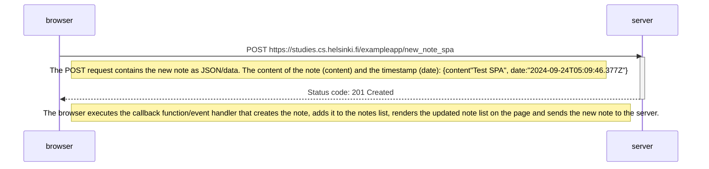

```mermaid
sequenceDiagram
    participant browser
    participant server

    browser->>server: POST https://studies.cs.helsinki.fi/exampleapp/new_note_spa
    activate server
    Note right of browser: The POST request contains the new note as JSON/data. The content of the note (content) and the timestamp (date): {content"Test SPA", date:"2024-09-24T05:09:46.377Z"}
    server-->>browser: Status code: 201 Created
    deactivate server
    Note right of browser: The browser executes the callback function/event handler that creates the note, adds it to the notes list, renders the updated note list on the page and sends the new note to the server.

```